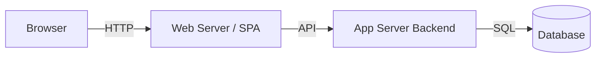
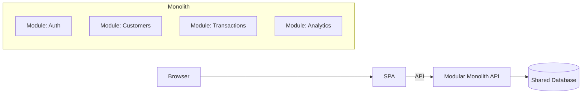
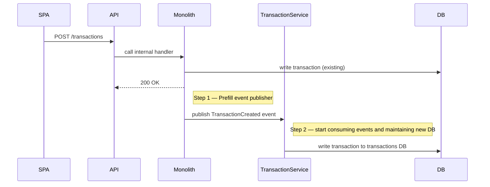

# Architecture Evolution — 3-Tier to Microservices & Modular Monolith

## Purpose

This document describes an evolution path from a classic **3‑tier architecture** to more advanced architectures: **modular monolith** and **microservices**. It includes design patterns, migration strategies, tradeoffs, example service boundaries, deployment models, and operational considerations tailored for the Customer Spending Insights application.

---

## Contents

1. Quick definitions
2. 3‑Tier architecture (diagram + pros/cons)
3. Modular Monolith (diagram + when to choose)
4. Microservices (diagram + when to choose)
5. Comparison: Modular Monolith vs Microservices
6. Migration path & incremental steps
7. Service boundaries & example modules/services
8. Cross-cutting concerns (auth, observability, infra)
9. Data strategy (shared DB vs per-service DB)
10. Deployment & CI/CD patterns
11. Operational readiness & cost considerations
12. Recommendations for Customer Spending Insights

---

## 1. Quick definitions

* **3‑Tier**: Presentation (frontend), Application (backend), Data (database).
* **Modular Monolith**: Single deployable application logically split into modules with clear boundaries and well-defined interfaces.
* **Microservices**: Many small, independently deployable services communicating over the network, each owning its own data.

---

## 2. 3‑Tier Architecture



**Pros**

* Simple to design and operate
* Low latency (in-process calls)
* Easier to test and deploy for small teams

**Cons**

* Tightly-coupled codebase
* Harder to scale different parts independently
* Risk of monolithic deployments becoming bottlenecks

**When to use**: MVP, small teams, low complexity.

---

## 3. Modular Monolith



**Characteristics**

* Single deployment unit, internal module boundaries enforced by code structure and interfaces.
* Modules communicate via in-memory calls or well-defined internal APIs.

**Pros**

* Lower operational overhead vs microservices
* Easier local debugging and transactional integrity
* Faster feature delivery early on

**Cons**

* Can still become large if boundaries aren't enforced
* Scaling limited by single process/container

**When to choose**: Growing product, need better modularity, teams starting to scale but not yet ready for microservices.

---

## 4. Microservices

```mermaid
flowchart LR
  Browser --> SPA
  SPA -->|API| API Gateway
  API Gateway --> S1[Auth Service]
  API Gateway --> S2[Customer Service]
  API Gateway --> S3[Transaction Service]
  API Gateway --> S4[Analytics Service]
  S1 --> DB1[(Auth DB)]
  S2 --> DB2[(Customer DB)]
  S3 --> DB3[(Transactions DB)]
  S4 --> DB4[(Analytics DW)]
```

**Characteristics**

* Each service independently deployable and owns its data
* Communication via REST/gRPC/Message Bus

**Pros**

* Independent scaling, teams, and deployments
* Fault isolation and technology heterogeneity
* Clear ownership boundaries

**Cons**

* Much higher operational complexity (networking, CI/CD, observability)
* Distributed transactions complexity
* Higher cost (infra + operational)

**When to choose**: Large teams, complex domains, need independent scaling or polyglot persistence.

---

## 5. Comparison: Modular Monolith vs Microservices

| Dimension            |                       Modular Monolith |                   Microservices |
| -------------------- | -------------------------------------: | ------------------------------: |
| Deployment           |                            Single unit |                      Many units |
| Operational overhead |                                    Low |                            High |
| Scalability          | Limited (vertical/horizontal replicas) |      High (per-service scaling) |
| Team autonomy        |                               Moderate |                            High |
| Complexity           |                                  Lower |                          Higher |
| Data consistency     |         Easy (single DB, transactions) | Hard (distributed transactions) |

---

## 6. Migration Path & Incremental Steps

1. **Start modular**: Design clear module boundaries in the monolith. Use interfaces and well-defined public module APIs.
2. **Introduce internal APIs**: Make module interactions use internal HTTP/gRPC or message patterns even inside the monolith to reduce coupling.
3. **Extract read models**: Create dedicated read-only services or caching layers for heavy query loads (CQRS pattern).
4. **Extract services by stability**: Pull out low-change, high-scale modules first (e.g., Auth, Transactions ingestion, Analytics).
5. **Adopt a messaging backbone**: Add Kafka/RabbitMQ for async events to decouple services.
6. **Split DBs**: Move towards per-service data ownership. Start by copying data into new DBs and syncing.
7. **Automate infra**: CI/CD pipelines, infra-as-code, observability, and service discovery.

**Tips**

* Use feature flags to toggle between implementations.
* Keep a strong contract and API versioning strategy.
* Automate tests for cross‑service contracts (consumer-driven contracts).

---

## 7. Service Boundaries & Example Modules/Services

**Suggested logical services for Customer Spending Insights**

* **Auth Service**: AuthN/AuthZ, tokens, roles
* **Customer Service**: Customer profiles, preferences
* **Transaction Service**: Ingests transactions, raw storage
* **Category Service**: Category metadata, taxonomy
* **Spending Summary Service**: Aggregations, monthly rollups, materialized views
* **Analytics/Reporting Service**: Advanced analytics, forecasting, time-series
* **Gateway/API**: Edge routing, authentication, rate limiting
* **Notifications Service**: Emails, in-app notifications

**Boundaries**: Services own their domain model and DB; communicate via events (`TransactionCreated`, `CategoryUpdated`, `GoalChanged`).

---

## 8. Cross-cutting Concerns

* **API Gateway**: central auth, routing, rate limit, request shaping.
* **Service Mesh** (optional): mTLS, traffic policies, observability (Istio/Linkerd).
* **Authentication**: Centralized identity (Auth0, Keycloak) or Auth Service with JWT.
* **Observability**: Distributed tracing (OpenTelemetry), metrics (Prometheus), logs (ELK/EFK).
* **Config & Secrets**: Vault / cloud KMS + central config service.

---

## 9. Data Strategy

* **Shared DB (monolith)**: Simpler consistency but coupling.
* **Per-service DB (microservices)**: Better isolation; requires data duplication and sync.
* **Event sourcing & CQRS**: For high-fidelity auditing and offline analytics; useful for financial events.
* **Data warehouse**: ETL to Redshift/BigQuery for long-term analytics and BI.

---

## 10. Deployment & CI/CD Patterns

* **Monolith**: Build -> Test -> Deploy single artifact. Blue/Green or Canary.
* **Microservices**: Per-service pipelines, container images, image registry, Helm charts or k8s manifests.
* **Infra as Code**: Terraform for infra provisioning.
* **Service catalog**: Document service contracts and owners.

---

## 11. Operational Readiness & Cost

* **Runbook**: Incident response runbooks, SLOs & SLAs.
* **Cost**: Microservices increase resource & team costs. Consider managed services (DBaaS, Kafka managed) to reduce operational burden.
* **Security**: Threat modeling, regular pentests for public endpoints.

---

## 12. Recommendations for Customer Spending Insights

* Start **modular monolith**: enforce module boundaries, build contracts, and automate tests. This reduces early operational friction while preparing for future splits.
* Identify **Transactions ingestion** and **Analytics** as first extraction candidates: high scale and independent lifecycle.
* Use **event-driven patterns** (Kafka/RabbitMQ) for decoupling and reliable async processing.
* Adopt **infrastructure automation and observability early** — it pays off when splitting to microservices.

---

## Appendix: Example sequence to extract Transaction Service



---

End of document.
