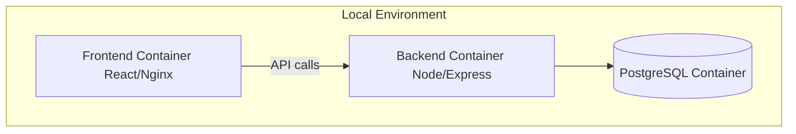
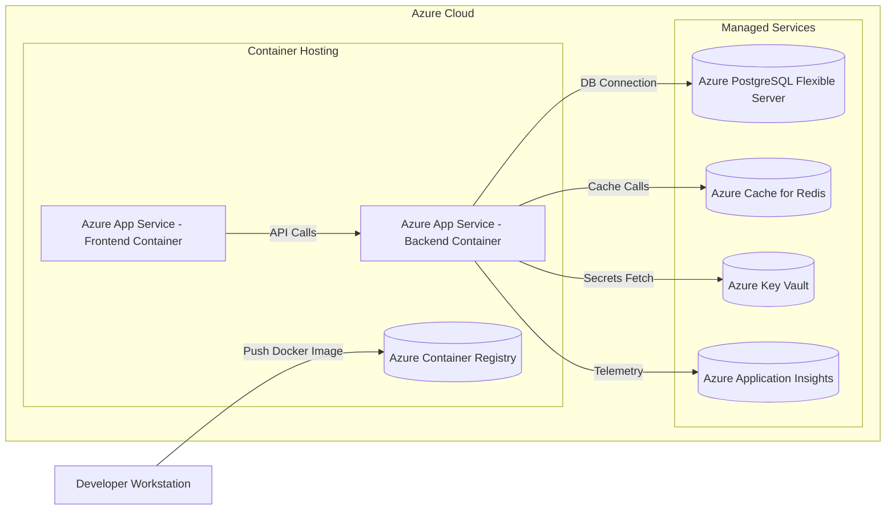
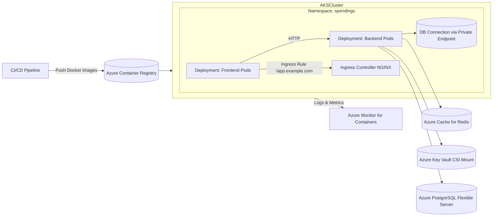
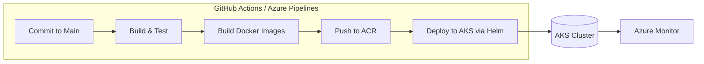
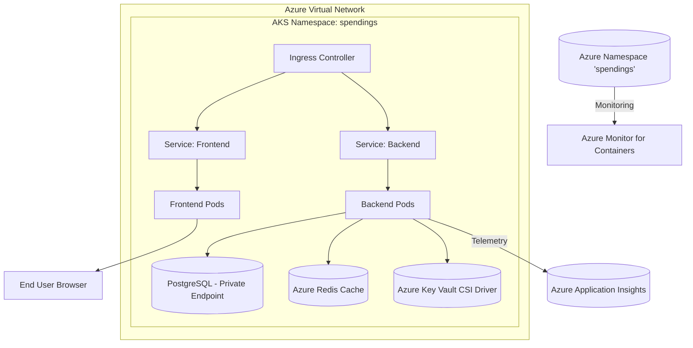
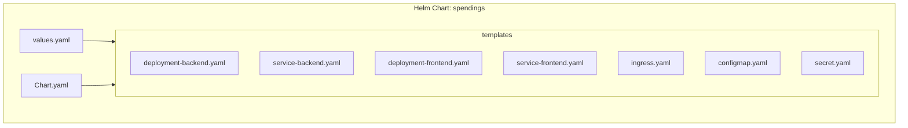
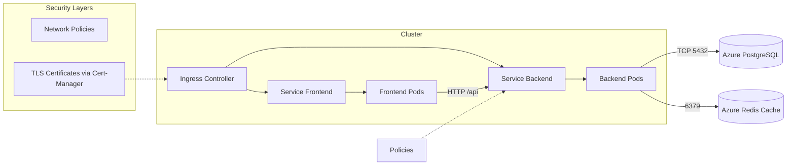
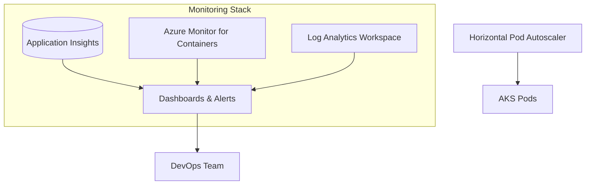
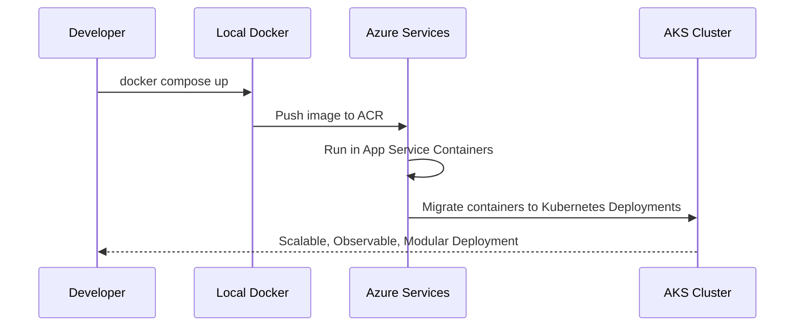

# Deployment Plan — Docker to AKS (Azure)

This document visualizes the **deployment evolution** from Docker to Azure-managed services and finally to **Kubernetes (AKS)** using Mermaid diagrams. It focuses on infrastructure, CI/CD flow, runtime topology, **Helm chart structure**, and **Kubernetes networking design** for the **Customer Spending Insights** dashboard.

---

## 1. Phase 1 — Local Docker Setup

**Notes:**

* Local development uses Docker Compose.
* Simplified single host deployment.
* Ideal for debugging, integration testing, and local development.

---

## 2. Phase 2 — Docker with Azure Services

**Highlights:**

* Each service runs as a container in **Azure App Service for Containers**.
* Azure-managed PostgreSQL handles persistence.
* Secrets stored securely in **Key Vault**.
* Observability via **Application Insights**.
* Images pushed to **Azure Container Registry (ACR)**.

---

## 3. Phase 3 — Transition to AKS (Azure Kubernetes Service)

**Highlights:**

* Frontend and backend are separate Deployments managed by Kubernetes.
* Ingress Controller (NGINX or AGIC) routes traffic to the correct service.
* **Secrets** pulled dynamically from **Key Vault** using CSI Driver.
* Telemetry and metrics go to **Azure Monitor**.
* PostgreSQL remains external but accessed privately via VNet/Private Link.

---

## 4. CI/CD Workflow Visualization

**Steps:**

1. Code pushed to main triggers CI pipeline.
2. CI builds & tests code, then builds Docker images.
3. Images pushed to Azure Container Registry.
4. CD deploys new version using **Helm** or `kubectl apply`.
5. Observability via Azure Monitor and Application Insights.

---

## 5. AKS Internal Topology (Detailed)

**Details:**

* Kubernetes handles replication, autoscaling (HPA), and service discovery.
* All outbound calls to managed Azure services are private and secured.
* Ingress provides HTTPS with Cert-Manager and Let's Encrypt.

---

## 6. Helm Chart Structure

**Explanation:**

* **Chart.yaml**: metadata (name, version, dependencies).
* **values.yaml**: default configs (replicas, image tags, URLs).
* **templates/**: YAML manifests rendered during deployment.
* Supports easy upgrades with `helm upgrade --install`.

---

## 7. Kubernetes Networking & Communication

**Key points:**

* Each Service abstracts Pods behind stable endpoints.
* Ingress manages external routing & SSL termination.
* Network Policies enforce isolation between Pods.
* Backend Pods communicate with external Azure services through private endpoints.

---

## 8. Observability & Scaling

**Notes:**

* Real-time metrics and alerts via Azure Monitor.
* HPA scales Pods automatically by CPU or request rate.
* Unified dashboards for app health, latency, and throughput.

---

## 9. Evolution Path Summary

**Transition Strategy:**

1. **Start small** — Docker Compose for local testing.
2. **Move to Azure App Service** — run containers with minimal ops overhead.
3. **Gradually migrate to AKS** — as scaling and modularity demand grow.
4. **Automate pipelines** — build, deploy, and monitor continuously.

---

## 10. Phase Summary Table

| Phase | Infrastructure                     | Description             | Key Benefits                                 |
| ----- | ---------------------------------- | ----------------------- | -------------------------------------------- |
| 1     | **Docker Compose**                 | Local containers        | Fast iteration, isolated dev environment     |
| 2     | **Azure App Services + ACR**       | Containers in Azure     | Easy hosting, integrated monitoring          |
| 3     | **Azure Kubernetes Service (AKS)** | Orchestrated containers | Scalable, fault-tolerant, modular deployment |

---

**End of Document**
