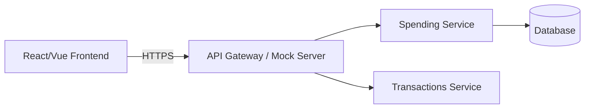
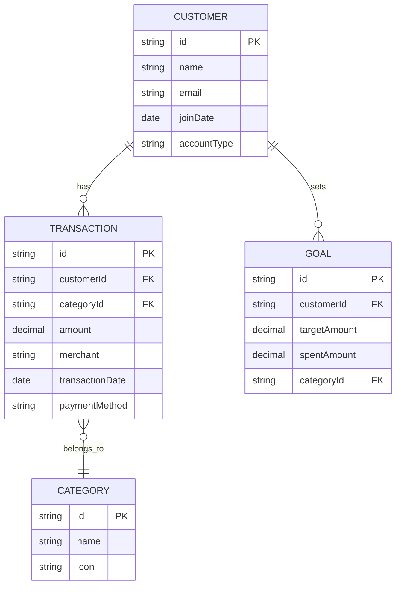
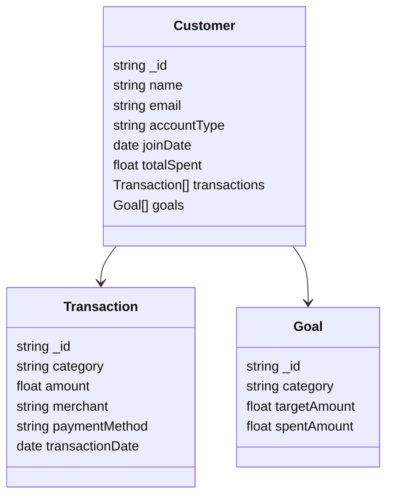
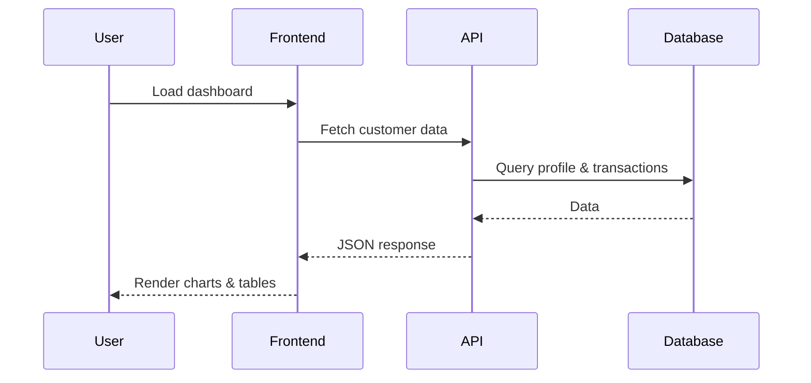

# Customer Spending Insights — Design & Implementation

## Overview

A responsive financial analytics dashboard that displays a customer's spending data (mocked). This document contains the full software design, UI layout, data model, API integration plan, mock-data strategy, database design, indexing strategy, deployment, testing, and non-functional requirements.

---

## Contents

1. Goals & requirements
2. Recommended tech stack
3. High-level architecture
4. Component breakdown (frontend & backend)
5. API mapping and integration
6. Data models & mock data
7. Database design (UML diagrams & tradeoffs)
8. Indexing & query optimization
9. UI / UX & responsive layout
10. Diagrams (high-level, low-level, user flow)
11. State management & caching
12. Testing, monitoring & CI/CD
13. Security, performance & privacy considerations
14. Roadmap & milestones

---

## 1. Goals & Requirements

**Functional**

* Display customer profile and key KPIs (totalSpent, avg txn, transactionCount).
* Visualize spending by category (pie/donut chart) and monthly trends (line chart).
* Paginated transactions list with filtering, sorting, and search.
* Display goals and budget usage.
* Date-range presets and custom range selection.

**Non-functional**

* Responsive (mobile, tablet, desktop).
* Fast: aim for <200ms local interactive responses using client-side mocks + caching.
* Accessible: keyboard navigable, semantic HTML, proper color contrast.
* Secure: access token-based API calls.

---

## 2. Recommended Tech Stack

**Frontend**

* Framework: React (functional components + hooks) or Vue 3.
* Styling: Tailwind CSS.
* Charts: Recharts or Chart.js.
* State: React Query (remote state) + Context API.
* Icons: Lucide / FontAwesome.

**Backend / API**

* Node.js + Express (mock API or real backend)
* Database: PostgreSQL (SQL) or MongoDB (NoSQL)
* ORM: Prisma / Sequelize (SQL) or Mongoose (NoSQL)

---

## 3. High-level Architecture



---

## 4. Component Breakdown

* DashboardPage: Displays KPIs, charts, and summaries.
* TransactionsPage: Shows transaction list, filters.
* ProfilePage: Customer info.
* Charts: `CategoryDonut`, `MonthlyTrend`.
* Services: `apiClient`, `customersApi`.
* Utils: formatters, date utils.

---

## 5. API Mapping & Integration

* `/api/customers/{id}/profile`
* `/api/customers/{id}/spending/summary`
* `/api/customers/{id}/spending/categories`
* `/api/customers/{id}/spending/trends`
* `/api/customers/{id}/transactions`
* `/api/customers/{id}/goals`

---

## 6. Data Models & Mock Data

**CustomerProfile**

* customerId: string
* name, email, joinDate, accountType
* totalSpent, currency

**CategorySummary**

* name, amount, percentage, transactionCount

**Transaction**

* id, date, merchant, category, amount, paymentMethod

---

## 7. Database Design (UML & Tradeoffs)

### 7.1 UML Diagram — SQL (Relational)



### 7.2 UML Diagram — NoSQL (Document / Collection)



### 7.3 Tradeoffs: SQL vs NoSQL

| Criteria                 | SQL (PostgreSQL, MySQL)                   | NoSQL (MongoDB, Firestore)            |
| ------------------------ | ----------------------------------------- | ------------------------------------- |
| **Data model**           | Structured, relational schema             | Flexible JSON-like documents          |
| **Querying**             | Strong JOIN support, complex aggregations | Nested docs, limited joins            |
| **Transactions**         | ACID compliant                            | Often eventual consistency            |
| **Scalability**          | Vertical scaling or sharding              | Horizontal scaling built-in           |
| **Schema evolution**     | Rigid (requires migration)                | Flexible, can evolve easily           |
| **Analytical workloads** | Excellent with SQL queries                | Needs MapReduce/Aggregation pipelines |
| **Use case fit**         | Banking, financial, normalized data       | Fast evolving, denormalized analytics |
| **Best for this app**    | ✅ SQL for precision and consistency       | ✅ NoSQL for rapid iteration           |

### Recommendation

For **Customer Spending Insights**, prefer **SQL (PostgreSQL)** because:

* Requires **accurate aggregation** and **consistent joins**.
* Financial data benefits from **ACID guarantees**.
* Can integrate **NoSQL cache (Redis/Mongo)** for fast analytics.

---

## 8. Indexing & Query Optimization

### 8.1 SQL (PostgreSQL)

**Indexes:**

* `CREATE INDEX idx_customer_id ON transactions(customerId);`
* `CREATE INDEX idx_transaction_date ON transactions(transactionDate);`
* `CREATE INDEX idx_category_id ON transactions(categoryId);`
* `CREATE INDEX idx_customer_category_date ON transactions(customerId, categoryId, transactionDate DESC);`

**Optimization strategies:**

1. **Partitioning**: Use monthly partitioned tables for transactions to speed up trend queries.
2. **Materialized views**: Pre-aggregate total spending by month and category.
3. **Query optimization**: Use `EXPLAIN ANALYZE` to inspect performance.
4. **Caching**: Use Redis or in-memory cache for summary queries.
5. **Connection pooling**: Manage database connections efficiently (pg-pool / pgbouncer).
6. **Use of JSONB**: Store dynamic metadata (e.g., merchant info) in JSONB for hybrid flexibility.

**Example optimized query:**

```sql
SELECT categoryId, SUM(amount) AS total, COUNT(*) AS count
FROM transactions
WHERE customerId = $1 AND transactionDate BETWEEN $2 AND $3
GROUP BY categoryId;
```

### 8.2 NoSQL (MongoDB)

**Indexes:**

* `{ customerId: 1 }`
* `{ category: 1, transactionDate: -1 }`
* Compound index: `{ customerId: 1, category: 1, transactionDate: -1 }`

**Optimization strategies:**

1. Use **aggregation pipelines** for grouped analytics (`$group`, `$sum`, `$project`).
2. Implement **sharding** based on `customerId` for distributed scaling.
3. Denormalize `category` data inside transactions for faster reads.
4. Use **TTL indexes** for ephemeral analytic caches.
5. Precompute aggregates and store in a separate `spending_summaries` collection.

**Example aggregation pipeline:**

```js
db.transactions.aggregate([
  { $match: { customerId: "123", transactionDate: { $gte: ISODate('2025-01-01') } } },
  { $group: { _id: "$category", totalSpent: { $sum: "$amount" }, count: { $sum: 1 } } },
  { $sort: { totalSpent: -1 } }
]);
```

### 8.3 Tradeoffs in Optimization

| Factor               | SQL                                      | NoSQL                               |
| -------------------- | ---------------------------------------- | ----------------------------------- |
| **Index cost**       | Higher on writes                         | Lower on reads, higher memory usage |
| **Aggregation**      | Efficient via GROUP BY, window functions | Needs pipelines or map-reduce       |
| **Scalability**      | Can require read replicas or sharding    | Scales horizontally with ease       |
| **Caching**          | DB-level caching (materialized views)    | Often handled in app-layer          |
| **Best choice here** | SQL for consistency, analytics accuracy  | NoSQL for high-velocity ingestion   |

---

## 9. UI / UX & Responsive Layout

* Responsive three-column dashboard.
* KPI cards, category donut chart, trends line chart, transactions table.
* Accessibility & color contrast compliant.

---

## 10. Diagrams — Flow & Sequence



---

## 11. State Management & Caching

React Query with cache invalidation and prefetching.

---

## 12. Testing, Monitoring & CI/CD

Unit tests (Jest), E2E (Playwright), CI (GitHub Actions), deploy to Vercel or Azure.

---

## 13. Security & Privacy

* HTTPS, JWT tokens, encrypted local storage.
* Mask sensitive data.

---

## 14. Roadmap

**Sprint 1**: Setup + Mock API
**Sprint 2**: Dashboard components
**Sprint 3**: Transactions, charts, persistence
**Sprint 4**: Testing + Deployment

---

*End of document.*
