# DevOps Documentation — Customer Spending Dashboard

This document provides comprehensive DevOps documentation including architecture diagrams, deployment strategies, CI/CD pipelines, and operational guidelines for the Customer Spending Dashboard.

---

## Table of Contents

1. [High-Level Architecture](#high-level-architecture)
2. [System Architecture Diagram](#system-architecture-diagram)
3. [Service Interaction Flow](#service-interaction-flow)
4. [Technology Stack](#technology-stack)
5. [Infrastructure Components](#infrastructure-components)
6. [Deployment Architecture](#deployment-architecture)
7. [CI/CD Pipeline](#cicd-pipeline)
8. [Environment Configuration](#environment-configuration)
9. [Monitoring & Observability](#monitoring--observability)
10. [Scaling Strategy](#scaling-strategy)
11. [Security Considerations](#security-considerations)
12. [Disaster Recovery](#disaster-recovery)

---

## High-Level Architecture

The Customer Spending Dashboard is built using a **microservices architecture** with **.NET Aspire** orchestration, **HotChocolate Fusion Gateway** for GraphQL aggregation, and a **React frontend**.

### Architecture Overview

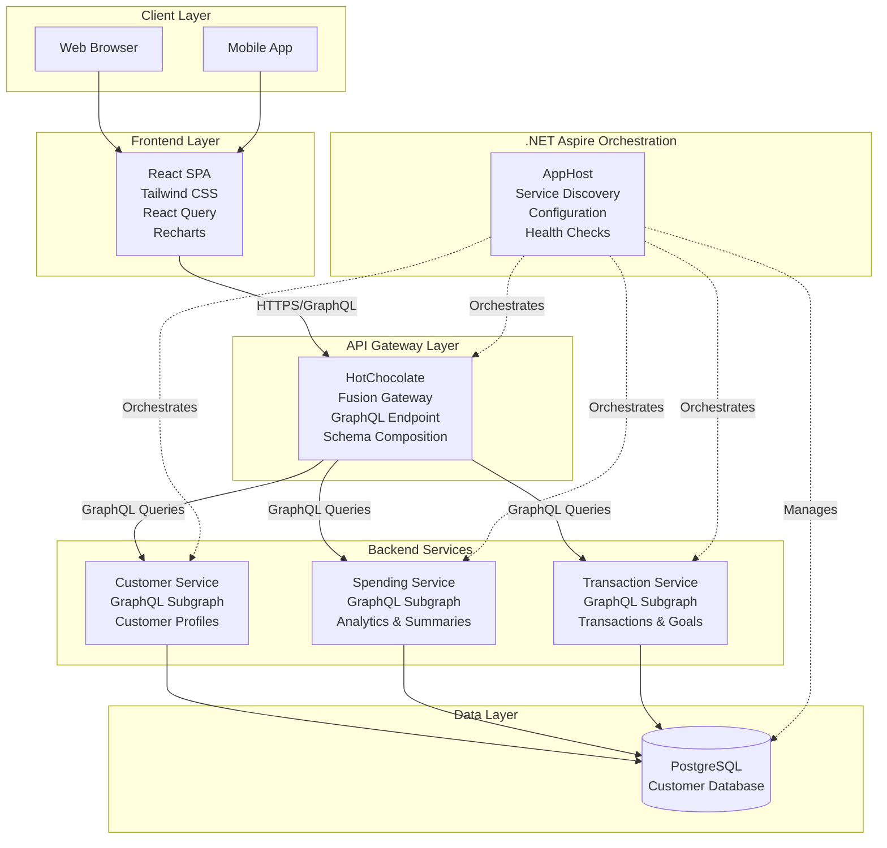

---

## System Architecture Diagram

### Detailed Component Architecture

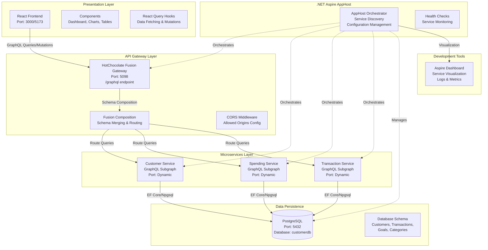

---

## Service Interaction Flow

### Request Flow Diagram

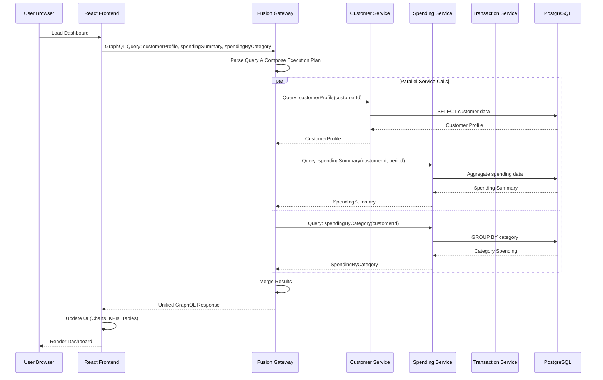

### Mutation Flow Diagram

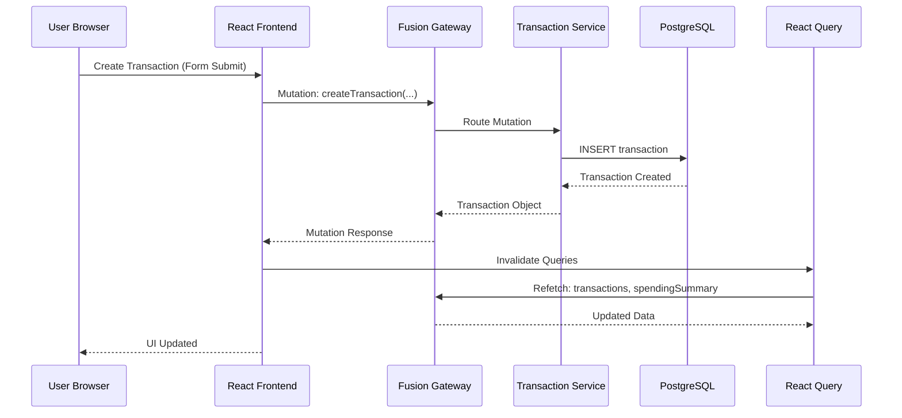

---

## Technology Stack

### Frontend
- **Framework**: React 18+ with TypeScript
- **Styling**: Tailwind CSS
- **State Management**: React Query (TanStack Query) + Context API
- **Charts**: Recharts
- **Routing**: React Router DOM
- **Build Tool**: Vite
- **HTTP Client**: graphql-request

### Backend
- **Orchestration**: .NET Aspire
- **API Gateway**: HotChocolate Fusion Gateway
- **GraphQL**: HotChocolate GraphQL Server
- **Framework**: .NET 8.0 / .NET 9.0
- **Database**: PostgreSQL
- **ORM**: Entity Framework Core (if implemented)

### Infrastructure
- **Container Runtime**: Docker
- **Orchestration**: Kubernetes (for production)
- **Service Discovery**: .NET Aspire Service Discovery
- **Configuration**: appsettings.json, Environment Variables

---

## Infrastructure Components

### Component Breakdown

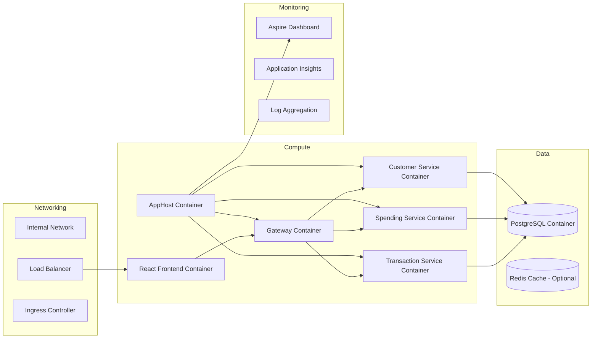

---

## Deployment Architecture

### Development Environment

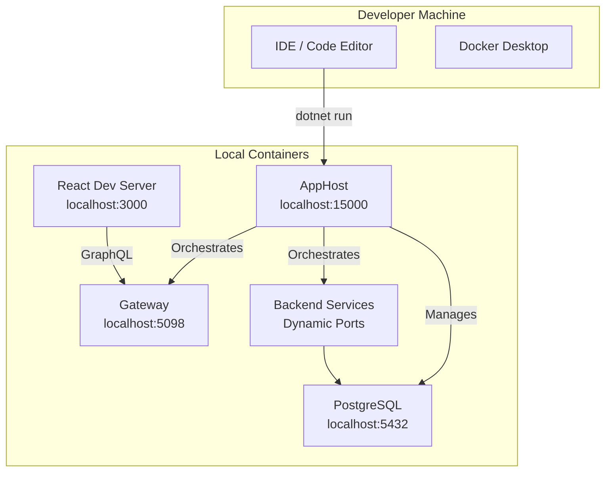

### Production Environment (Azure Kubernetes Service)

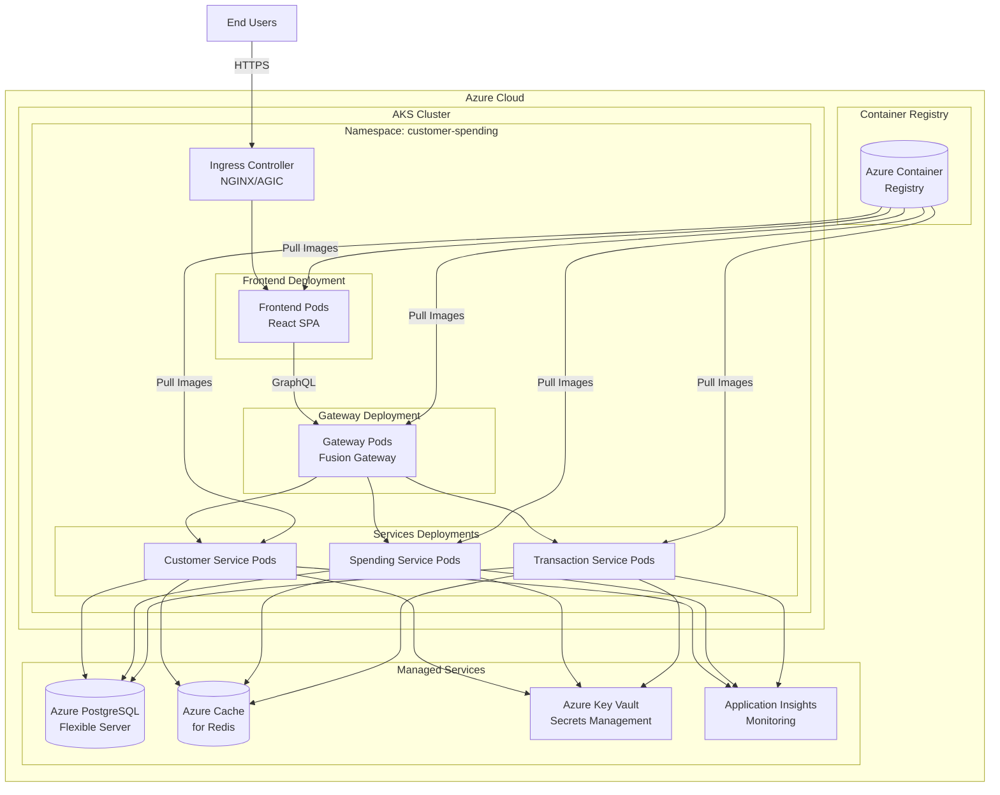

---

## CI/CD Pipeline

### Continuous Integration & Deployment Flow

```mermaid
flowchart LR
    subgraph "Source Control"
        GIT[Git Repository<br/>GitHub/Azure DevOps]
    end

    subgraph "CI Pipeline"
        BUILD[Build & Test<br/>dotnet build<br/>npm test]
        LINT[Code Quality<br/>ESLint, SonarQube]
        SECURITY[Security Scan<br/>Snyk, OWASP]
    end

    subgraph "Container Build"
        DOCKER_BUILD[Docker Build<br/>Multi-stage Builds]
        IMAGE_TAG[Image Tagging<br/>Version + Git SHA]
    end

    subgraph "Container Registry"
        ACR_PUSH[Push to ACR<br/>Azure Container Registry]
    end

    subgraph "CD Pipeline"
        DEPLOY_DEV[Deploy to Dev<br/>AKS Dev Namespace]
        TEST_E2E[E2E Tests<br/>Playwright/Cypress]
        DEPLOY_PROD[Deploy to Prod<br/>AKS Prod Namespace<br/>Blue/Green Strategy]
    end

    subgraph "Monitoring"
        HEALTH_CHECK[Health Checks<br/>Service Validation]
        ROLLBACK[Auto Rollback<br/>On Failure]
    end

    GIT -->|Push/PR| BUILD
    BUILD --> LINT
    LINT --> SECURITY
    SECURITY --> DOCKER_BUILD
    DOCKER_BUILD --> IMAGE_TAG
    IMAGE_TAG --> ACR_PUSH
    ACR_PUSH --> DEPLOY_DEV
    DEPLOY_DEV --> TEST_E2E
    TEST_E2E --> DEPLOY_PROD
    DEPLOY_PROD --> HEALTH_CHECK
    HEALTH_CHECK -->|Failure| ROLLBACK
    HEALTH_CHECK -->|Success| MONITOR[Monitor Production]
```

### Pipeline Stages

1. **Build Stage**
   - Restore NuGet packages
   - Build .NET projects
   - Run unit tests
   - Build React frontend
   - Run frontend tests

2. **Container Stage**
   - Build Docker images for each service
   - Tag images with version and commit SHA
   - Scan images for vulnerabilities

3. **Deploy to Dev**
   - Deploy to AKS development namespace
   - Run integration tests
   - Validate service health

4. **Deploy to Production**
   - Manual approval gate
   - Blue/Green deployment strategy
   - Health checks and smoke tests
   - Automatic rollback on failure

---

## Environment Configuration

### Configuration Management

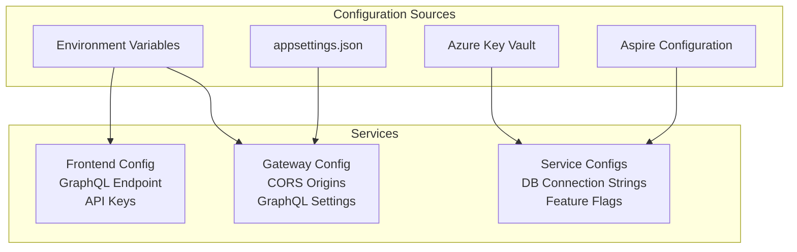

### Environment Variables

**Gateway**
- `Cors:AllowedOrigins` - Frontend origins
- `ASPNETCORE_ENVIRONMENT` - Environment name

**Services**
- `ConnectionStrings:DefaultConnection` - PostgreSQL connection string
- `ASPNETCORE_ENVIRONMENT` - Environment name

**Frontend**
- `VITE_GRAPHQL_ENDPOINT` - Gateway GraphQL endpoint URL

---

## Monitoring & Observability

### Observability Stack

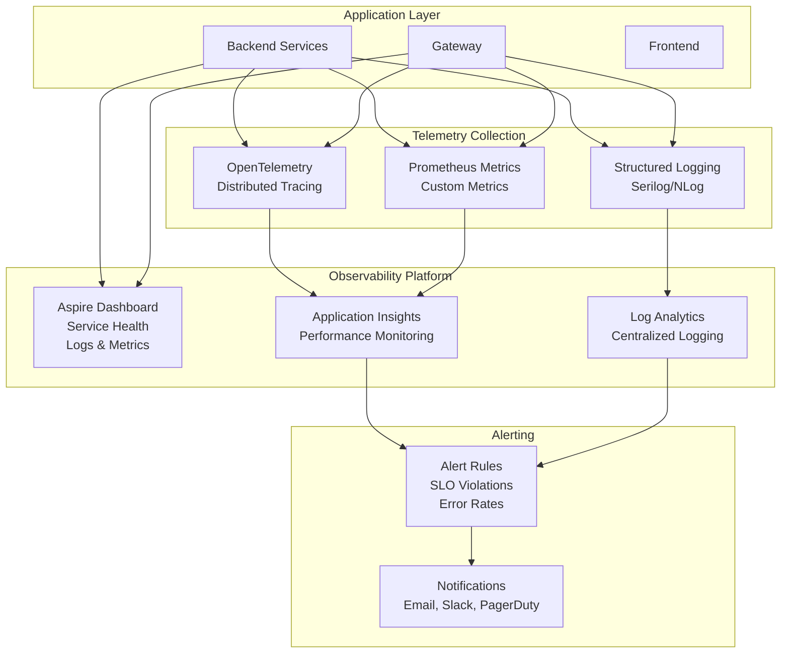

### Key Metrics

- **Service Health**: HTTP status codes, response times
- **GraphQL Performance**: Query execution time, error rates
- **Database Performance**: Connection pool usage, query latency
- **Frontend Performance**: Page load times, API call durations
- **Resource Usage**: CPU, memory, network I/O

---

## Scaling Strategy

### Horizontal Scaling

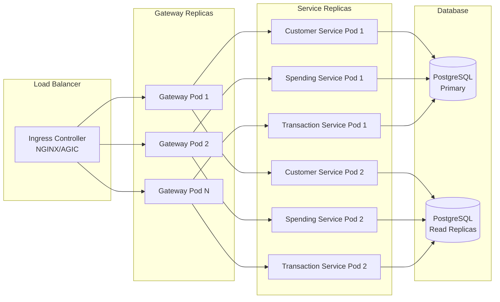

### Auto-Scaling Configuration

- **Horizontal Pod Autoscaler (HPA)**: Scale based on CPU/memory usage
- **Vertical Pod Autoscaler (VPA)**: Adjust resource requests/limits
- **Database Scaling**: Read replicas for query-heavy workloads

---

## Security Considerations

### Security Architecture

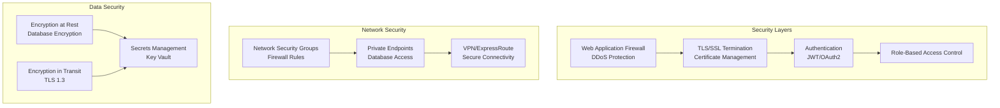

### Security Best Practices

1. **Authentication & Authorization**
   - JWT tokens for API authentication
   - OAuth2 for external identity providers
   - Role-based access control (RBAC)

2. **Network Security**
   - Private endpoints for database access
   - Network policies in Kubernetes
   - Firewall rules restricting access

3. **Data Protection**
   - Encryption at rest (database)
   - Encryption in transit (TLS 1.3)
   - Secrets stored in Azure Key Vault

4. **Application Security**
   - Input validation and sanitization
   - GraphQL query depth limiting
   - Rate limiting on API endpoints
   - CORS configuration

---

## Disaster Recovery

### Backup & Recovery Strategy

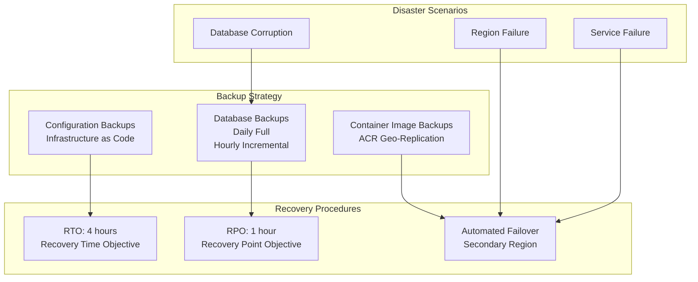

### Recovery Procedures

1. **Database Recovery**
   - Point-in-time recovery (PITR)
   - Automated backups to geo-redundant storage
   - Regular restore testing

2. **Service Recovery**
   - Multi-region deployment
   - Automated failover mechanisms
   - Health check-based routing

3. **Data Recovery**
   - Regular backup validation
   - Disaster recovery drills
   - Documentation of recovery procedures

---

## Quick Reference

### Service Endpoints

- **Frontend**: `http://localhost:3000` (dev) / `https://app.example.com` (prod)
- **GraphQL Gateway**: `http://localhost:5098/graphql`
- **Aspire Dashboard**: `http://localhost:15000`
- **PostgreSQL**: `localhost:5432`

### Key Commands

```bash
# Start all services (AppHost)
cd codebase/src/AppHost
dotnet run

# Start frontend
cd codebase/src/frontend
npm install
npm run dev

# Build Docker images
docker-compose build

# Deploy to AKS
helm upgrade --install customer-spending ./helm-chart
```

---

## Additional Resources

- [.NET Aspire Documentation](https://learn.microsoft.com/en-us/dotnet/aspire/)
- [HotChocolate Fusion Documentation](https://chillicream.com/docs/hotchocolate/v13/federation/fusion/)
- [React Query Documentation](https://tanstack.com/query/latest)
- [Azure Kubernetes Service Documentation](https://learn.microsoft.com/en-us/azure/aks/)

---

**Last Updated**: 2025-01-XX
**Maintained By**: DevOps Team

